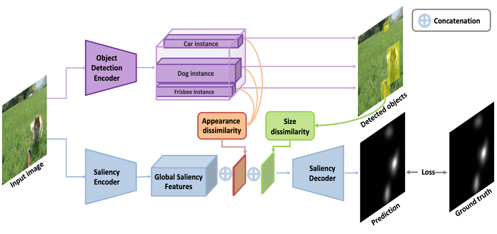

# (TMLR 2022) Modeling Object Dissimilarity for Deep Saliency Prediction 
[Transactions on Machine Learning Research]
Bahar Aydemir*, Deblina Bhattacharjee*, Tong Zhang, Seungryong Kim, Mathieu Salzmann and Sabine Süsstrunk

*Equal contribution

Code will be published soon. Thanks for your patience!

TMLR 2022 Paper:https://openreview.net/forum?id=NmTMc3uD1G

Project Page: https://ivrl.github.io/DisSal

Example of how object appearance dissimilarity between multiple objects and size dissimilarity
affect saliency maps. We show, from left to right, a) the input image from the SALICON benchmark (Jiang et al.,
2015), b)the ground-truth fixations, c) the saliency prediction of the baseline DeepGazeII (Kümmerer et al., 2017),
d) the saliency prediction of Our model that uses both dissimilarity (D) and size masks (S), e) the calculated
appearance dissimilarity mask (D) and f) the calculated size mask (S). The cats have similar saliency values in
the ground truth whereas in the baseline DeepGazeII the right cat is more salient than the other one. Our model
improves the prediction for the left cat with the help of the appearance dissimilarity mask, which indicates that
the left cat with distinct fur colors is the most dissimilar object. Further, the similar sizes of the cats result in similar
values in the size mask while the bed is larger. 



Overview of the proposed architecture. We use an object detector to extract object instances.
We then pass on these object features to calculate appearance dissimilarity (shown in orange), which results in a
dissimilarity score for each object instance. The object detection network also outputs a bounding box for each
object, which we use to calculate the normalized object size dissimilarity (shown in green) for each detection. We
then fuse (1) the encoded global saliency features resulting from the saliency encoder, (2) the object appearance
dissimilarity features, and (3) the normalized object size dissimilarity features. We train our saliency decoder on
this concatenated feature set. We supervise the training with a KLD loss between the predicted
saliency map and the ground-truth one.

1. Install pytorch,torchvision
2. Install apex
```
conda install -c conda-forge nvidia-apex 
```


##  Citation
If you find the code, data, or the models useful, please cite this paper:
```
 @article{
aydemir2022modeling,
title={Modeling Object Dissimilarity for Deep Saliency Prediction},
author={Bahar Aydemir and Deblina Bhattacharjee and Tong Zhang and Seungryong Kim and Mathieu Salzmann and Sabine S{\"u}sstrunk},
journal={Transactions on Machine Learning Research},
year={2022},
url={https://openreview.net/forum?id=NmTMc3uD1G}
}

```
## License 
``` 
 [MIT License](https://choosealicense.com/licenses/mit/)
```
