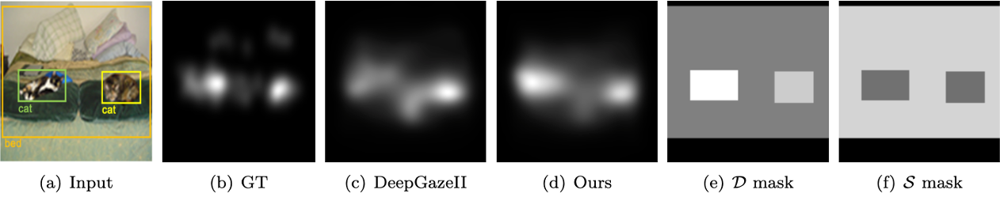

# (TMLR 2022) Modeling Object Dissimilarity for Deep Saliency Prediction 
[Transactions on Machine Learning Research]
Bahar Aydemir*, Deblina Bhattacharjee*, Tong Zhang, Seungryong Kim, Mathieu Salzmann and Sabine Süsstrunk

Code will be published soon. Thanks for your patience!

TMLR 2022 Paper:https://openreview.net/forum?id=NmTMc3uD1G
Project Page: https://ivrl.github.io/DisSal


1. Install pytorch,torchvision
2. Install apex
```
conda install -c conda-forge nvidia-apex 
```


##  Citation
If you find the code, data, or the models useful, please cite this paper:
```
  TBA
```
## License 
``` 
 [MIT License](https://choosealicense.com/licenses/mit/)
```
